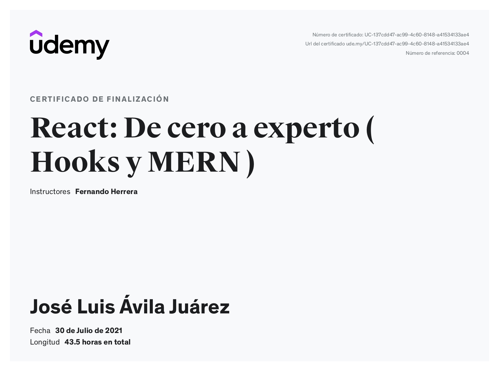

Curso de React (Stack de MERN) 2021 Udemy
===============

Este repositorio contiene todas las prácticas de mi curso de React especialidado en el stack de **MERN** (*MongoDB, Express, React y Node*) impartido por Fernando Herrera.

Este curso contiene diversos temas, como los siguientes:

- Componentes de React
- Hooks
- Custom Hooks
- React Router
- Fetch
- AJAX
- Crear builds de producción
- GitHub Pages
- Heroku
- Redux
- Creación y protección de rutas
- Express
- MongoDB
- SASS
- Autenticación con Firebase
- Firestore

... entre otras cosas.

Mi certificado de finalización 
---------------

